# Bitácora — Juan Gomez  
## DOSW2 

# Patrones Creacionales

## Abstract Factory
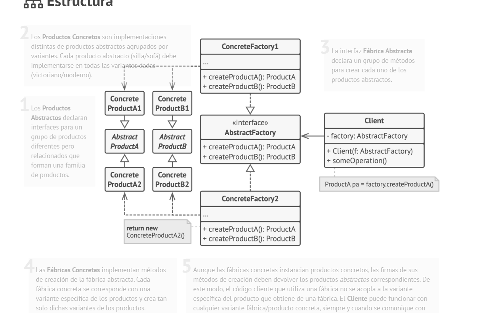

Permite crear familias de objetos relacionados sin especificar sus clases concretas.  
Se usa cuando existen múltiples variantes de un mismo conjunto de productos y se quiere garantizar que sean compatibles entre sí.

---

## Builder
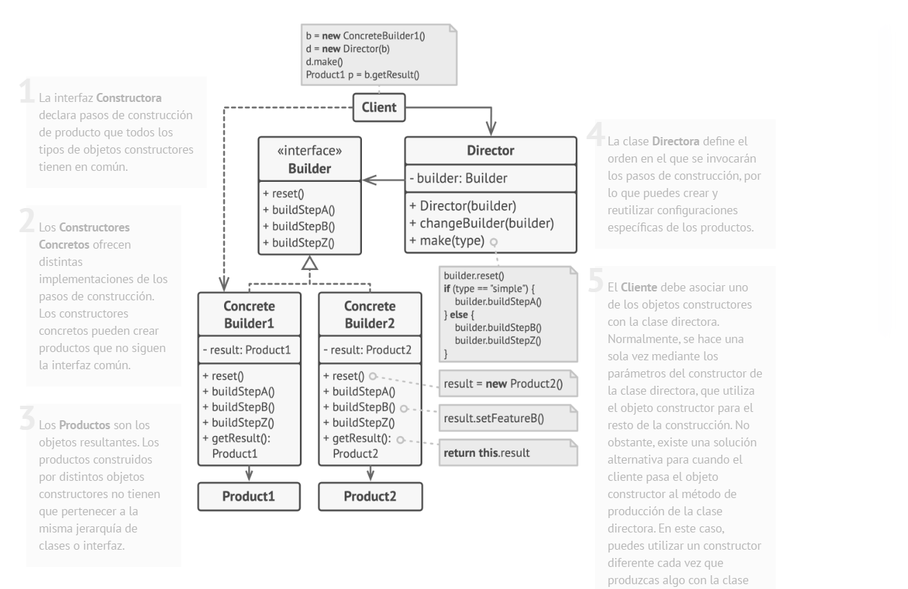

Permite construir objetos complejos paso a paso, separando el proceso de construcción de la representación final.  
Es útil cuando un objeto tiene muchas configuraciones posibles.

---

## Factory Method
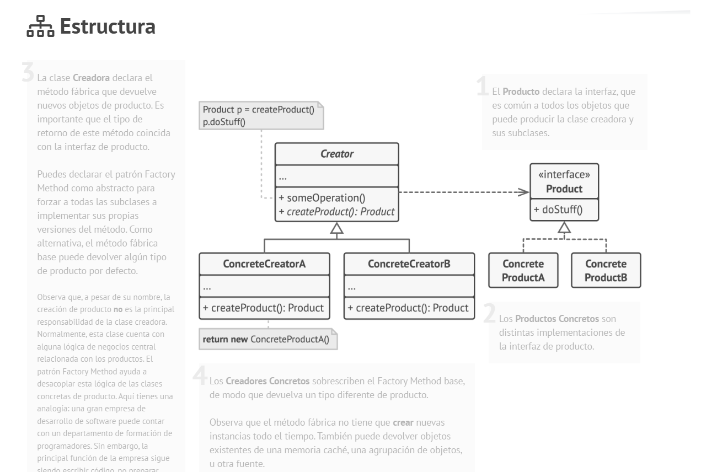

Define una interfaz para crear objetos, pero permite que las subclases decidan qué clase concreta instanciar.  
Reduce la dependencia directa con clases específicas.

---

# Patrones Estructurales

## Adapter
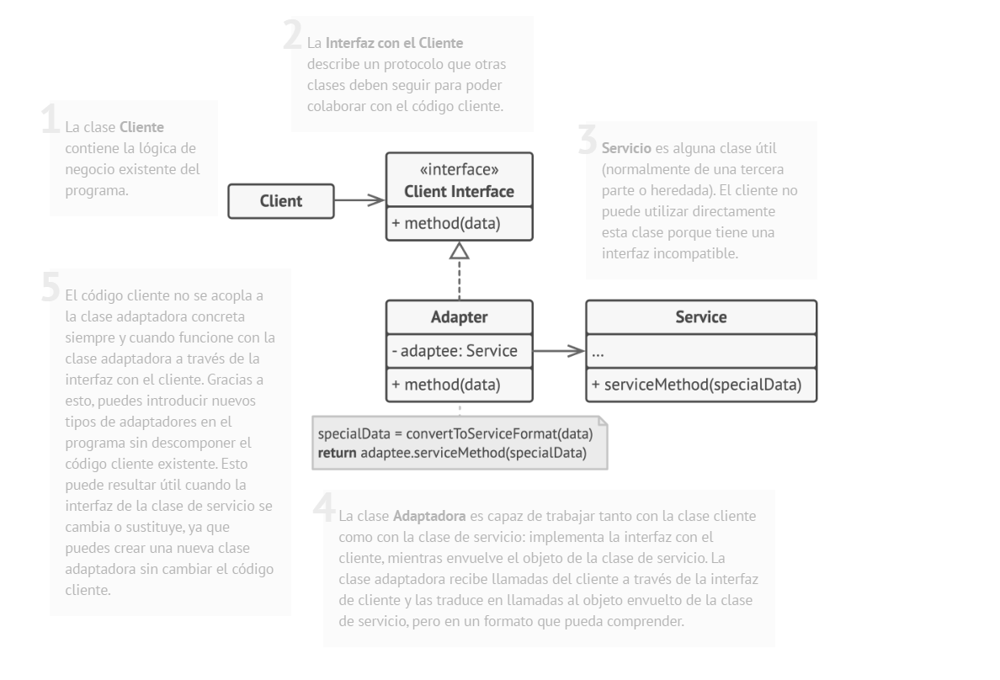

Permite que clases con interfaces incompatibles trabajen juntas.  
Actúa como un traductor entre dos clases sin modificar su código original.

---

## Bridge
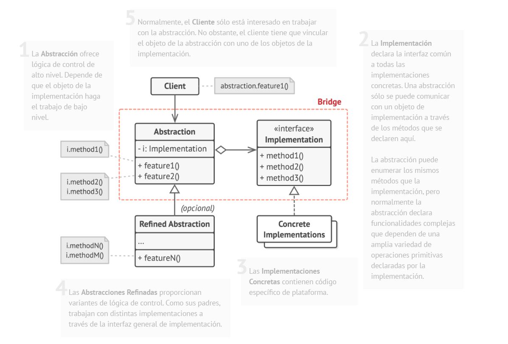

Separa una abstracción de su implementación para que ambas puedan variar independientemente.  
Evita la explosión de clases cuando existen múltiples combinaciones posibles.

---

## Composite
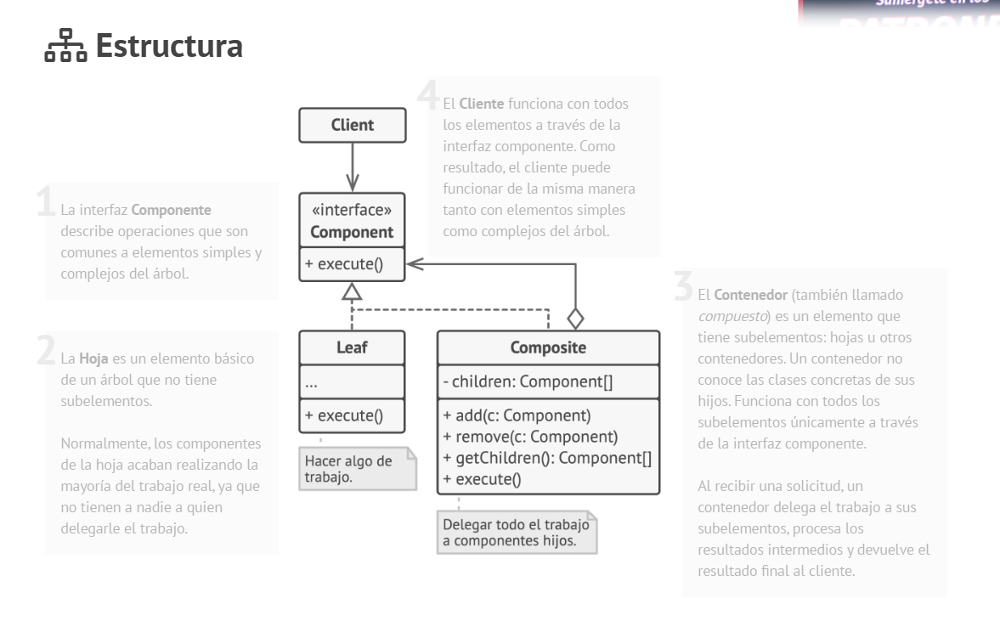

Permite tratar objetos individuales y composiciones de objetos de manera uniforme.  
Es útil para representar estructuras jerárquicas como árboles o agrupaciones.

---

## Decorator
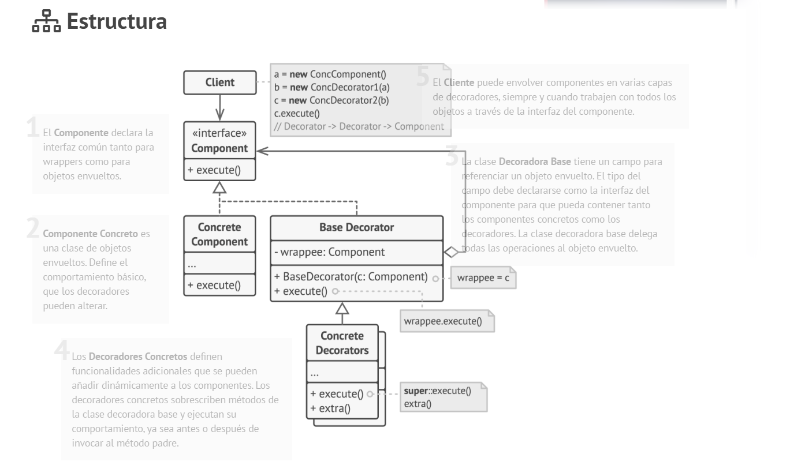

Permite añadir responsabilidades a un objeto de forma dinámica sin modificar su estructura original.  
Es una alternativa flexible a la herencia para extender funcionalidades.

---

# Patrones de Comportamiento

## Chain of Responsibility
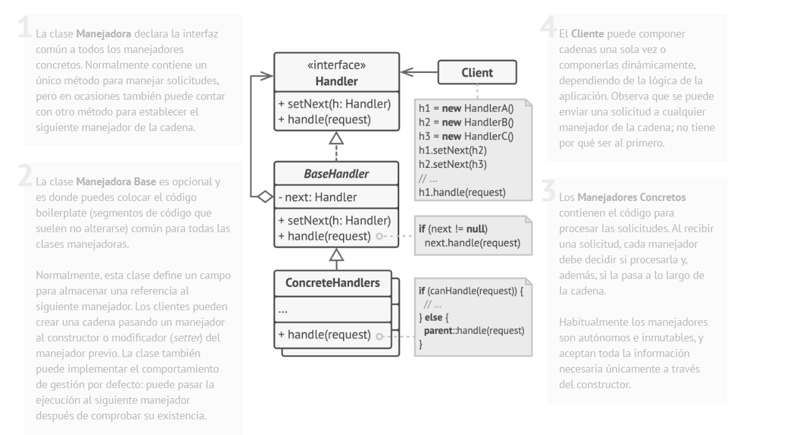

Permite pasar una solicitud a través de una cadena de objetos hasta que uno la procese.  
El emisor no sabe quién manejará la petición, lo que reduce el acoplamiento.

---

## Command
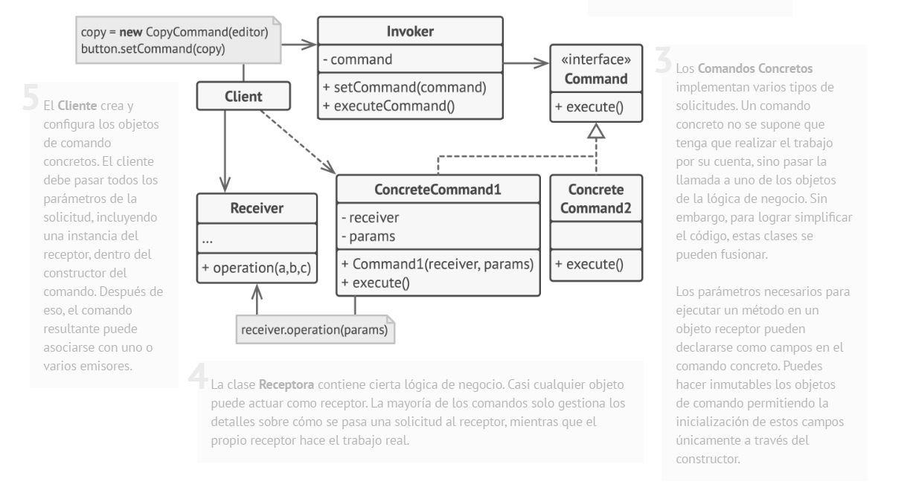

Encapsula una solicitud como un objeto, permitiendo parametrizar acciones, almacenarlas o deshacerlas.  
Es común en sistemas donde se ejecutan acciones como botones o comandos.

---

## Iterator
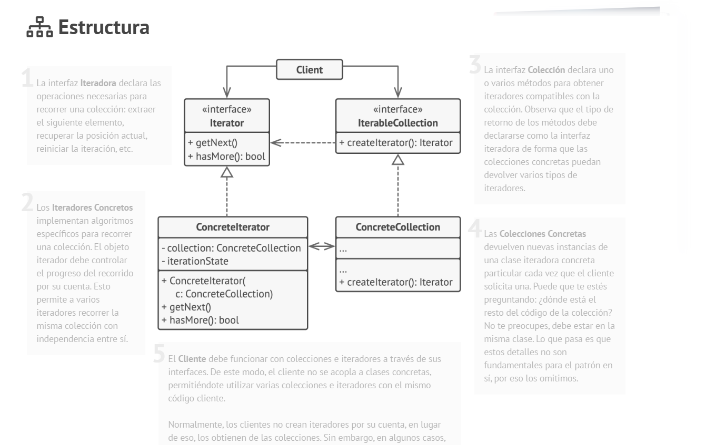

Permite recorrer los elementos de una colección sin exponer su estructura interna.  
Separa la lógica de recorrido de la estructura de datos.

---

## Mediator
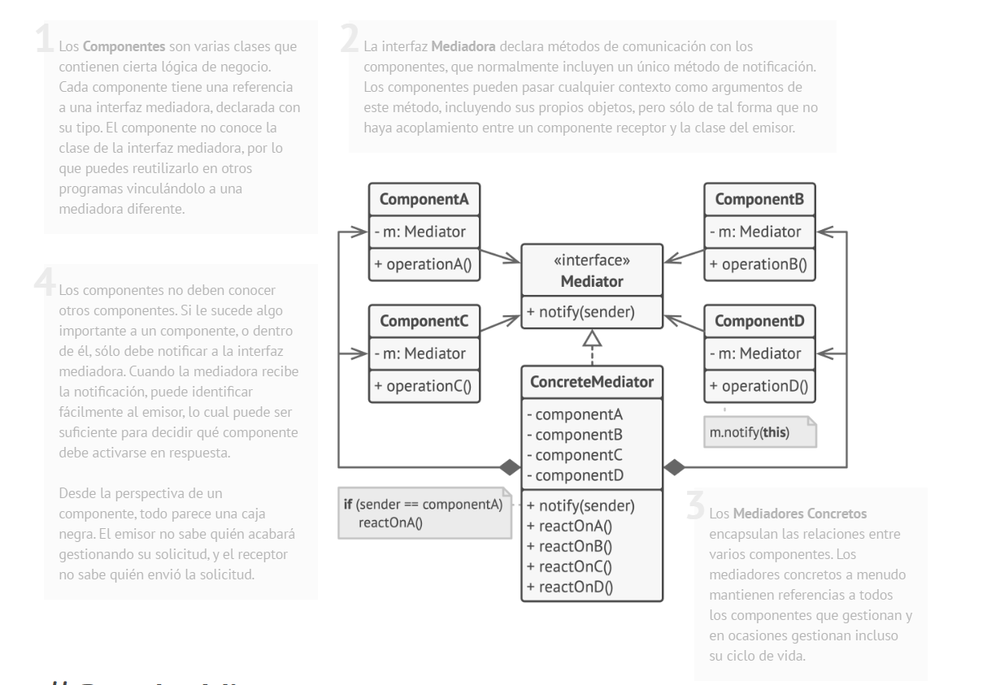

Centraliza la comunicación entre varios objetos para evitar dependencias directas entre ellos.  
Reduce el acoplamiento al hacer que los objetos interactúen a través de un mediador.

---

## Memento
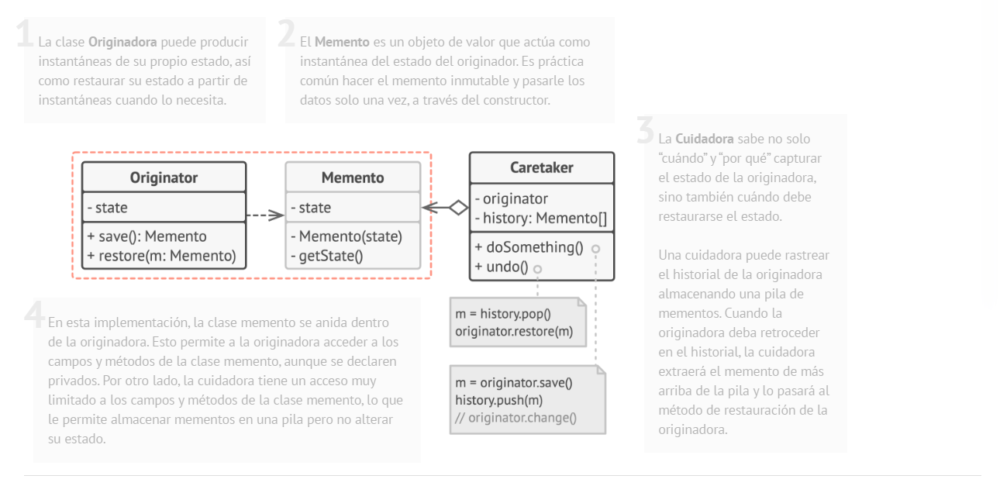

Permite guardar y restaurar el estado interno de un objeto sin violar el encapsulamiento.  
Es útil para implementar funcionalidades como deshacer.

---

## Strategy
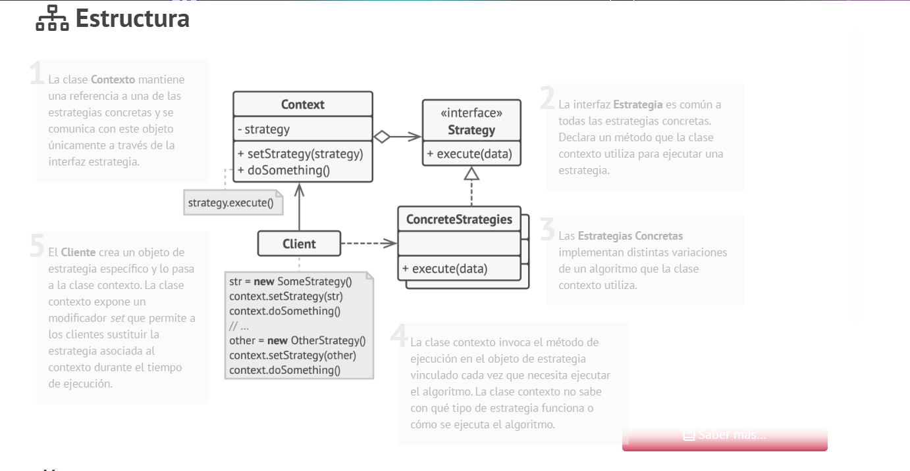

Define una familia de algoritmos intercambiables y permite cambiar el comportamiento de un objeto en tiempo de ejecución sin modificar su código.

## Desglose de trabajo: Épicas, Historias de Usuario y Tareas

La implementación de los requerimientos se organiza en tres niveles: Épicas, Historias de Usuario y Tareas.

---

# 1. Épicas

| Campo        | Descripción |
|-------------|------------|
| ID          | Identificación única de la épica |
| Título      | Nombre representativo de la épica |
| Descripción | Justificación y objetivo general de la épica |
| Stakeholder | Interesado principal que solicita o se beneficia de la épica |

---

# 2. Historias de Usuario

| Campo        | Descripción |
|-------------|------------|
| ID          | Identificación única de la historia de usuario |
| Título      | Nombre breve que describe la funcionalidad |
| Descripción | Redacción en formato: "Como [tipo de usuario], quiero [acción] para [beneficio]" |
| Prioridad   | Nivel de importancia (Alta, Media, Baja) |
| Estimación  | Esfuerzo estimado en puntos de historia |

---

# 3. Tareas

| Campo                              | Descripción |
|-------------------------------------|------------|
| ID                                  | Identificación única de la tarea |
| Título                              | Nombre descriptivo de la tarea técnica |
| ID de la Historia de Usuario asociada | Identificador de la historia de usuario relacionada |
| Descripción                         | Actividad específica que debe realizarse |
| Tareas requisito                    | Identificadores de tareas de las cuales depende |