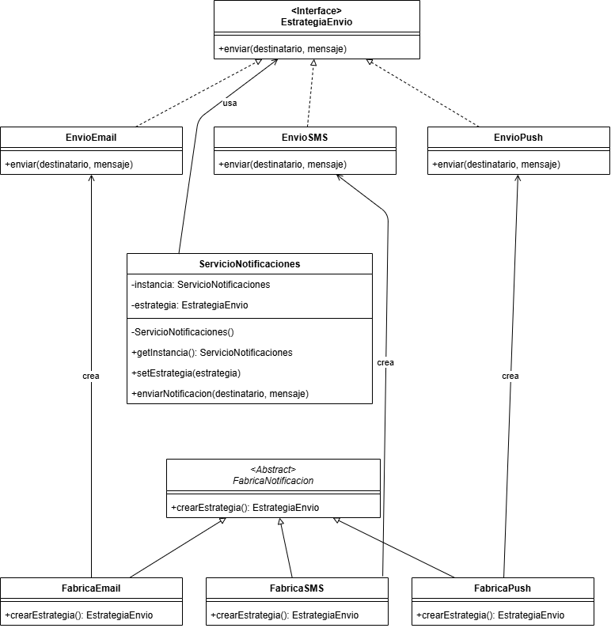

# Ejercicio 1 - Sistema de Notificaciones

## Patrones de Diseño Utilizados

---

### 1. Strategy

**Tipo:** Comportamental

**Justificación:**
Se usó porque el sistema puede enviar notificaciones por distintos canales (Email, SMS, Push) y necesitaba poder cambiar ese canal sin tocar el resto del código. Strategy es adecuado porque separa cada forma de envío en su propia clase.

---

### 2. Singleton

**Tipo:** Creacional

**Justificación:**
Se usó porque el servicio de notificaciones debe ser único en todo el sistema. Singleton es adecuado para evitar que se creen varias instancias que puedan causar envíos duplicados.

---

### 3. Factory Method

**Tipo:** Creacional

**Justificación:**
Se usó para poder agregar nuevos canales de notificación sin modificar el código que ya existe. Factory Method es adecuado porque cada canal tiene su propia fábrica que sabe cómo crearlo.

---

## Diagrama de Clases UML

---

## Cobertura con JaCoCo

---

## Análisis estático con SonarQube

