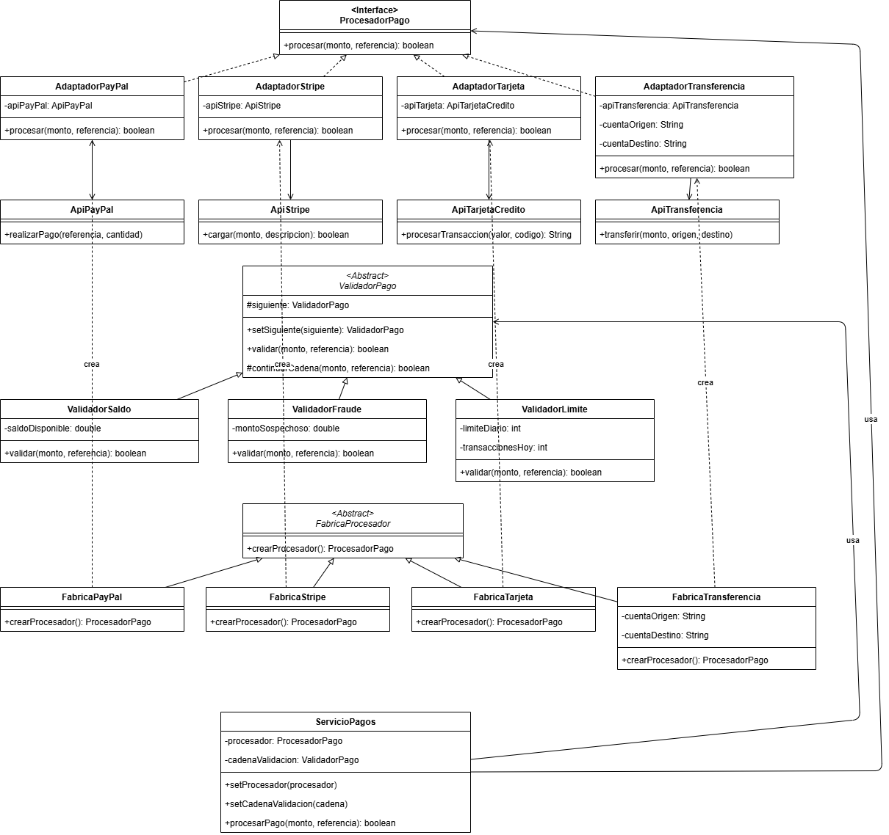
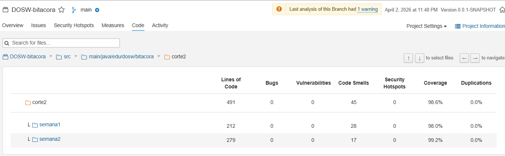

# Ejercicio 2 - Sistema de Procesamiento de Pagos

## Patrones de Diseño Utilizados

---

### 1. Adapter

**Tipo:** Estructural

**Justificación:**
Se usó porque cada proveedor de pago (PayPal, Stripe, Tarjeta, Transferencia) funciona de forma distinta. Adapter es adecuado para que el sistema pueda usar cualquier proveedor sin necesidad de conocer cómo funciona internamente cada uno.

---

### 2. Chain of Responsibility

**Tipo:** Comportamental

**Justificación:**
Se usó porque el pago debe pasar por varias validaciones (saldo, fraude, límite) en orden, y si una falla el proceso se detiene. Chain of Responsibility es adecuado porque permite encadenar esas validaciones de forma ordenada sin mezclarlas en un solo lugar.

---

### 3. Factory Method

**Tipo:** Creacional

**Justificación:**
Se usó para poder agregar nuevos proveedores de pago sin tocar el código existente. Factory Method es adecuado porque cada proveedor tiene su propia fábrica que sabe cómo crearlo.

---

## Diagrama de Clases UML

---

## Cobertura con JaCoCo

---

## Análisis estático con SonarQube

